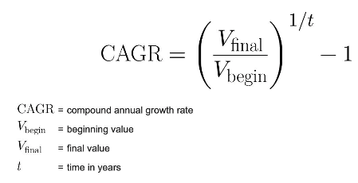

# General Assembly Capstone Project: Analysing Twitter Data to Predict the Price of Stock Market Indices (FTSE)

## Executive Summary
Four-week final project for my General Assembly data science immersive course. I conducted an exploratory study to ascertain whether sentiment extracted from Twitter can be used to predict the price of stock market indices (FTSE).
For this project I had to develop my own dataset. I scraped tweets that mentioned a particular Index (‘FTSE’) from Twitter and conducted Vader sentiment analysis on individual tweets. I then applied a range of Data Mining techniques, this involved formatting and combining different datapoints. I downloaded the FTSE historical data, created the Returns column (percentage change of the Closing price), and joined the two DataFrame’s together to get the final dataset. Followed by Exploratory Data Analysis (EDA), where I calculated the correlation between mean twitter sentiment and the Returns. The second step involved the application of modelling techniques on the dataset, I applied Linear Regression modelling. The results highlighted that this was a poor model, the predicted score was lower than the baseline (0.0.0022320050_LR). From a statistical point of view, it’s clearly a very bad fit. Nevertheless, because of the projects narrative it’s more central to explore the economical aspect. 
For the final part of the project, I conducted a ‘Backtest’ and devised a trading strategy that predicted the direction and return of the FTSE index. I established cumulative P&L scores, which revealed that from an economic perspective that it is a good course of option.

## Files in This Repository
- Presentation Slides: This was prepared to present the projectm findings, results, adn reccomendations to a non-technical audience
- Technical Report: This was prepared for reporting and explaining my project to a technical audience. It offers a detailed explanation of thea literature review, data cleaning, feature engineering process, exploratory data analysis, findings per research question, limitations and recommendations for future research.

#### - Jupyter notebook
  - Step 1: Dataset and Data Collection
  - Step 2: Data Cleaning and Exploratory Data Analysis
  - Step 3: Data Modelling
  - Step 4: Backtesting and Devising a Trading Strategy
  
## The Problem
The ability to predict asset prices would be highly valuable for investors and other parties. Consequently, the field of stock market prediction has received a great deal of attention from both academia and businesses. Behavioural finance research shows that our emotion and mood play a large and important role in our financial decision-making. Therefore, it is reasonable to assume that the public sentiment, mood and opinion may affect the stock market prices and movements. For this project I aim to find out if sentiment extracted from Twitter can be used to predict the direction of Returns of a Stock Market Index.

## Objectives
Exploratory study; The aim is to investigate if sentiment expressed on Twitter has an effect on Price of Individual Stock Market Indices (FTSE).

-	Can Twitter Data be used to predict the Price of an Index up to one day ahead?
-	Is Twitter a suitable data source to help forecast future stock market movement?

## Hypothesis
1. Twitter Sentiment reflects the mood of the market.
2. Twitter can be used to predict the direction of future stock market movements.

# Project Workflow

### Constructing the Twitter Scraper
When starting this project, the biggest challenge I faced was scraping twitter. Constructing and running the Twitter Scraper was the most time-consuming part of the project. 

-	I wanted to get data that covered a full economic cycle, so i set the date range from February 2007, a few months prior to the burst of the housing bubble in the US.
-	Twitter API is limited to scraping 18,000 tweets per a 15-minute window. Because of this I set the maximum number of tweets that can be scraped per day to 1200 so that the scraper isn’t too time consuming (took roughly 3 days to finish).
-	I extracted the 'date’, ‘text', 'username', 'hashtags', 'favorites', 'retweets', 'mentions', 'replies' from each tweet scraped.

Scraper Code:
		def my_pmap(f,jobs,num_procs=10):  
				return Parallel(n_jobs=num_procs)(delayed(f)(i) for i in jobs)

		from datetime import datetime
		from time import time,sleep
		num_tweets = 1200
		want_incremental = True
		num_tweets_enc = 0
		start_time = time()
		dt_range = pd.date_range(start=datetime(2007, 2, 1),  end =datetime(2020, 8, 15))
		index = 'FTSE'
		def datewise(dt):
						if (os.path.exists(f'Equity_sentiment_twitter/tweets_{index}_{dt:%Y%m%d}.csv') and want_incremental):
								return
						print(f' i am inside date {dt:%Y%m%d}')
						successful_api_call= False
						while successful_api_call==False:
								try:
										tweetCriteria = got.manager.TweetCriteria().setQuerySearch(f'{index}')\
																									 .setSince(f'{dt:%Y-%m-%d}')\
																									 .setUntil(f'{dt+pd.Timedelta(days=1):%Y-%m-%d}')\
																									 .setMaxTweets(num_tweets)\
																									 .setEmoji("unicode")\
																									 .setLang('english')
										tweet = got.manager.TweetManager.getTweets(tweetCriteria)
										successful_api_call = True
								except:
										print(f'Encountered an error. Retrying.')
                
        print(f'Day tweets = {len(tweet)}')
        df = pd.DataFrame(columns=['date','text', 'username', 'hashtags', 'favorites', 'retweets', 'mentions', 'replies'])
        for i in range(0, len(tweet)):
            mydict = {'author_id':tweet[i].author_id, 'date':tweet[i].date,'text':tweet[i].text, 'username':tweet[i].username, 'hashtags':tweet[i].hashtags, 'retweets':tweet[i].retweets, 'favorites':tweet[i].favorites, 'mentions':tweet[i].mentions, 'replies':tweet[i].replies}
            df = df.append(mydict,ignore_index=~True)
        df.to_csv(f'Equity_sentiment_twitter/tweets_{index}_{dt:%Y%m%d}.csv')
        

		my_pmap(datewise,dt_range,num_procs=-1)

### VADDER sentiment analysis
The VADER library is limited when conducting analysis on financial subject matters. Important financial terms such as ‘up’, ‘down’, ‘bull’, and ‘bear’ aren’t in the dictionary.  So, I added certain words which I considered to be an important addition into the library. Furthermore, after finding out about VADER’s limitations, I decided to incorporate the Loughran-McDonald finance word dictionary into its library so as to make the sentiment scores more precise. 

	from vaderSentiment.vaderSentiment import SentimentIntensityAnalyzer
	analyzer = SentimentIntensityAnalyzer()
	pos_words = ['up','bull','high']
	neg_words = ['down','bear','low']
	uncertain_words = ['shaky']
	words = pd.read_csv('finance_dict.csv') # < Loughran-McDonald finance word dictionary
	for col in words.columns:
			words[col] = words[col].str.lower()
	pos_words = pos_words + list(words.positive)
	neg_words = neg_words + list(words.negative)
	uncertain_words = uncertain_words + list(words.uncertain)

	new_words_dict = {}
	for word in pos_words + neg_words + uncertain_words:
			if word in pos_words:
					new_words_dict[word] = 1
			elif word in neg_words:
					new_words_dict[word] = -1
			else:
					new_words_dict[word] = -0.2

	analyzer.lexicon.update(new_words_dict)

### Consolidate the Tweets and their sentiment scores into one big file. (500MB)

	df = []
	# dt_range = pd.date_range(start=datetime(2011,1,1),end=datetime(2011,1,31))
	for dt in dt_range:
			print(f' i am inside date {dt:%Y%m%d}')
			if not os.path.exists(f'Equity_sentiment_twitter/tweets_{index}_{dt:%Y%m%d}.csv'):
					continue
			df.append(pd.read_csv(f'Equity_sentiment_twitter/tweets_{index}_{dt:%Y%m%d}.csv'))
	df = pd.concat(df,ignore_index=True)
	df.text = df.text.astype(str)
	if not os.path.exists(f'Equity_sentiment_twitter/{index}_consolidated'):
			os.mkdir(f'Equity_sentiment_twitter/{index}_consolidated')
	df.to_csv(f'Equity_sentiment_twitter/{index}_consolidated/tweets_and_sentiment_consolidated.csv')
	df['score'] = df.text.apply(lambda x: sentiment_analyzer_scores(x))
	df.to_csv(f'Equity_sentiment_twitter/{index}_consolidated/tweets_and_sentiment_consolidated_with_sentiment.csv')

### Data Mining: Cleaning the Data 
Applied a wide range of data mining techniques. 

After scraping twitter, I ended up with a total of 2,497,676 tweets along with their assigned sentiment scores. After examining the dataset, I noticed that tweets with null sentiment scores were generally off-topic when it came to discussing the financial aspect of the Index. I decided it’s best to remove these tweets, furthermore these tweets can be detrimental when conducting next step of the data mining process.  I was left with 1,360,736 tweets.
The Second step involved consolidating the individual tweet scores into a mean sentiment score of the specific day they were tweeted. I grouped the tweets into bin dates. Stock exchanges close at 4.00pm. Because of this I assigned tweets tweeted after 4.00pm to the next working day. This also applies to holidays and weekend tweets, which were assigned to Monday.
Finally, I created three new columns score_retweets, score_replies, and score_favorites, which were the mean and weighted mean (favorites, retweets, replies) score of all tweets for specific days. 

Got the first part of the DataFrame which was 3293 rows.

The second data point required for the final dataset was the FTSE’s historical data since 2007, I downloaded the data from the wall street journal and then derived the Returns column from the data by calculating. The percentage change of the closing price. Finally, I got the dataset by joining these two DataFrames together.

There weren’t many people using Twitter back in 2007, hence there weren’t many tweets about the FTSE. Consequently, there were missing dates in the dataset. Because of this I did a right join to get accurate daily returns.

	FTSE_historical = pd.read_csv('/Users/ataiotorbaev/Desktop/General_Assembly_DSI/DSI13-lessons/project/project-capstone/FTSE_data/FTSE_HistoricalPrices.csv')
	FTSE_historical.Date = pd.to_datetime(FTSE_historical.Date)
	FTSE_historical = FTSE_historical.sort_values(by = 'Date', ascending=True).reset_index(drop=True)
	FTSE_historical['Returns'] = FTSE_historical[' Close'].pct_change()
	FTSE_historical = FTSE_historical.rename(columns={'Date': 'bindate',' Close': 'Close'}).set_index('bindate')[['Close', 'Returns']]
	FTSE_historical

### Exploratory Data Analysis(EDA)
Calculated the summary statistics. Firstly, I analysed of contemporaneous correlation between the different Scores (‘score’, ‘score_retweets’, ‘score_replies’, ‘score_favorites’) and Returns. Secondly, I analysed the shifted correlation i.e. the correlation between todays scores and the next day’s Returns.

I noticed there was inconsistent data prior to 2013 so I conducted the visualisation techniques for the dataset after 2013 (ftse2013). 

#### score
Contemporaneous correlation:	0.32798691276405945
Shifted Correlation: -0.01585059480986884
#### score_retweets
Contemporaneous correlation:	0.20919808145477406
Shifted Correlation:	-0.005416047601653761
#### score_replies
Contemporaneous correlation:	0.14483136453883919
Shifted Correlation:	0.016877667071874606
#### score_favorites
Contemporaneous correlation:	0.19376169807880445
Shifted Correlation:	0.02048940286074888

### Modelling: Linear Regression

After conducting EDA on the dataset, it was clear that the shifted linear regression (LR) won’t be a good fit, there is high daily volatility in the stock. The results of LR confirmed this, the model performs poorly. The LR score 0.0022320055663610505 is lower than baseline score 0.028240040342914774, from a statistical point of view, it’s clearly a very bad model.  Nonetheless, because of the projects narrative it’s more central to explore the economical aspect.

## Backtesting & Devising a Trading Strategy
To explore the economic perspective, I ‘backtested’, this is a key component to the development of an effective trading strategy. It is accomplished by reconstructing, with historical data, trades that would have occurred in the past using rules defined by the derived strategy.

- Trading Strategy: A trading strategy is the method of buying and selling in markets that is based on predefined rules used to make trading decisions.

- Backtesting assesses the viability of a trading strategy by discovering how it would play out using historical data. If backtesting works, traders and analysts may have the confidence to employ it going forward. 

### Evaluate the Accumulated Returns | Profit & Loss Vector

#### The Trading Strategy: Choose a position either long or short depending on if the twitter sentiment score on a specific date is greater or lower than the last weeks/ 5 business days (time period) average. 

#### Make a Decision on which position to take based on Twitter sentiment at the closing time.
- Having a “long” position in a security means that you own the security. Investors maintain “long” security positions in the expectation that the stock will rise in value in the future. The opposite of a “long” position is a “short” position.
- A "short" position is generally the sale of a stock you do not own. Investors who sell short believe the price of the stock will decrease in value. If the price drops, you can buy the stock at the lower price and make a profit.

Trading Strategy Code:
	def plot_pnl(s):
			s = s.to_frame(name='Cumulative_P&L')
			s = s.reset_index()
			s.plot(kind='line', x='bindate', y='Cumulative_P&L', figsize=(12,9) )
	for var in ['score', 'score_retweets', 'score_replies', 'score_favorites']:
			pos = ftse13[var]
			print(var)
			pos = pos - pos.rolling(window=5,min_periods=1).mean()  #subtracts bias
			# position vector long or short it
			pos = np.sign(pos)#convert to 1 or -1
			pnl = pos.shift(1) * ftse.Returns
			cumpnl = pnl.cumsum()
			plot_pnl(cumpnl)
			plt.title(var)

#### The Process of Getting Trading Strategy ^
-	Set a Position Vector (Get a mean zero. This subtracts the Bias)
-	Convert it to 1 or -1 (Long or Short)
-	Profit & Loss, look at the position taken yesterday and todays Return (I.e. If we chose Long yesterday and Return today is positive than there is a Profit)
-	Cumulative Profit & Loss (Accumulates the Profits since the start date)
-	Finally Plot the Graphs for Visualisation

### Evaluating The Trading Strategy

#### (CAGR) Compound Annual Growth Rate
- Score Replies: 8.24%
- Score Favorites: 6.38%
- Inflation Rate 2017: 2.56%

#### Calculate Sharpe Ratio 
-  Sharpe Ratio is used to help investors understand the return of an investment compared to its risk. The ratio is the average return earned in excess of the risk-free rate per unit of volatility or total risk. Volatility is a measure of the price fluctuations of an asset or portfolio. Fundamentally, the ratio reflects the consistency of the return.

#### - score: 0.1450019271904248
#### - score_retweets: 0.028753019956425315
#### - score_replies: 0.670240885675957
#### - score_favorites: 0.46919295607869493

#### Grid Search for optimal Sharpe Ratio 
Performed a Grid Search to find out the optimal weights for the variables and the optimal lookback time period. 
Created a new optimal_score column, whose Sharpe ratio was 0.6836777690933067 and CAGR 8.43%.

## Findings and Overview
- Accept the two hypothesis.

The results indicate that Twitter data is a suitable source to help understand and forecast future stock market movements.
Sentiment extracted from Twitter has significant predictive power for predicting the direction of stock Returns.

The Trading Strategy devised works, and proves that it is possible to generate profits over a large timeframe by only Twitter.
